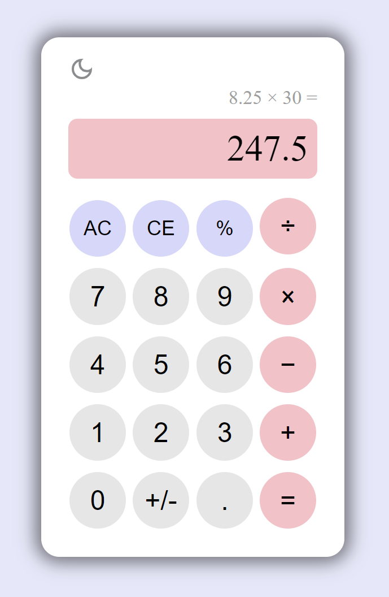
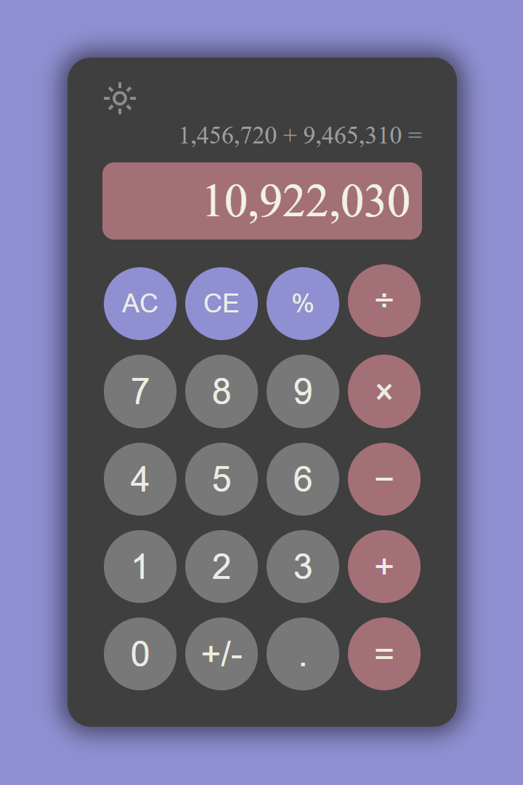

# Calculator

A calculator that performs arithmetic operations. 

## Features
- **Keyboard Support**: Perform calculations using keyboard inputs for digits, operators, and special functions. 
- **Secondary Memory Display**: Shows the numbers and operations entered for easy tracking.
- **Dark Mode**: Toggle between light and dark themes for a customized experience.
- **Clear Functions**: 
  - **All Clear**: Resets the calculator and clears all inputs.
  - **Clear Entry**: Removes the most recent digit or number entry.
- **Sign Change, Decimal Points, and Percentages**: Easily toggle signs, compute decimals, and calculate percentages.

## Technologies Used

- **HTML**
- **CSS**
- **JavaScript**

## Live Preview

You can view a live preview of the project [here](https://angelina010.github.io/calculator/).

## Screenshots

  
  

