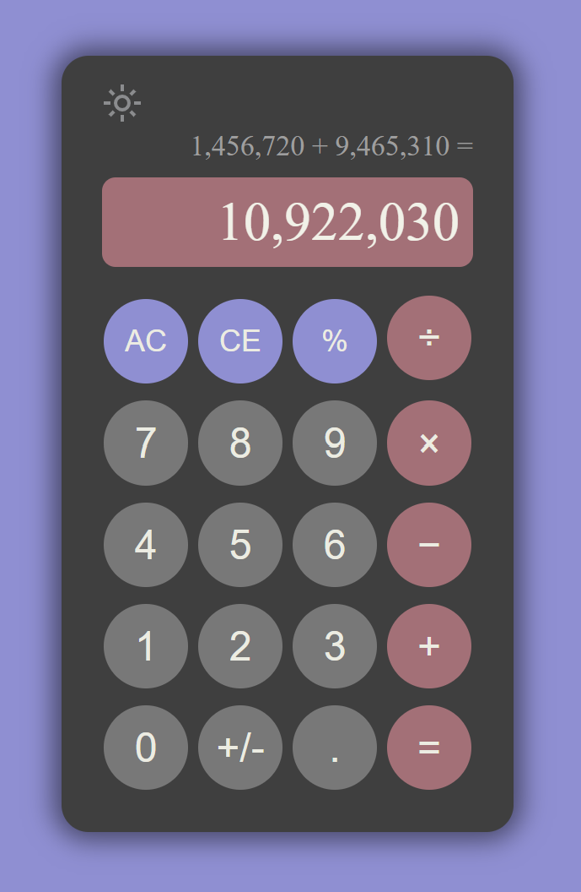

# Calculator

A calculator that performs arithmetic operations. 

## Features
- **Clear Functions**: 
  - **All Clear**: Resets the calculator and clears all inputs.
  - **Clear Entry**: Removes the most recent digit or number entry.
- **Sign Change**: Toggle the sign of the current number.
- **Decimal Points**: Add decimal points to numbers.
- **Percentage Calculation**: Convert numbers to their decimal equivalent as a percentage.
- **Secondary Memory Display**: Shows the numbers and operations entered for easy tracking.
- **Dark Mode**: Toggle between light and dark themes for a customized experience.

## Technologies Used

- **HTML**
- **CSS**
- **JavaScript**

## Live Preview

You can view a live preview of the project [here](https://angelina010.github.io/calculator/).

## Screenshots

  
  

